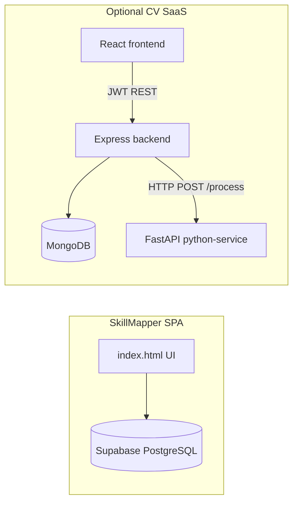
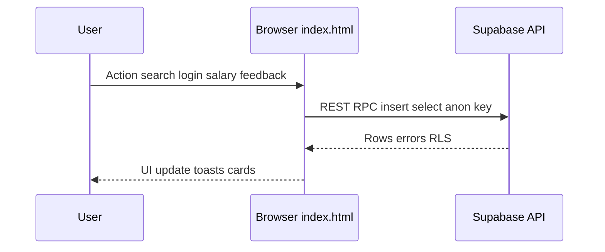
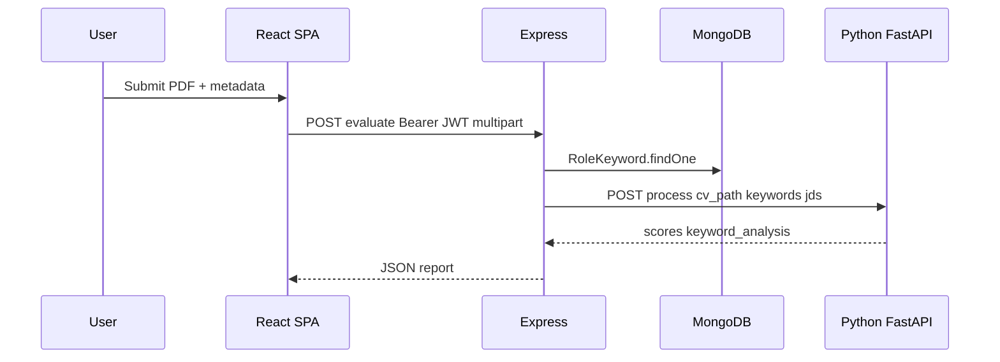
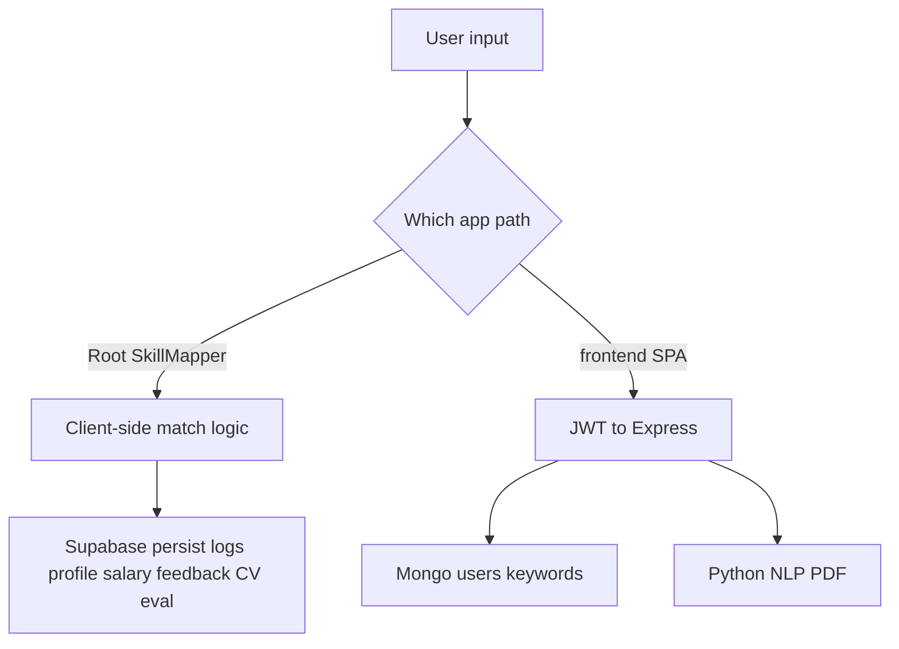

# Skillmapping — System Context (`context.md`)

This document summarizes the repository for onboarding. It reflects the codebase layout as of the latest inspection.

---

## Project Overview

This repository contains **two parallel deliverables**:

1. **SkillMapper (production focus)** — A large **single-page application** served from the repo root as **`index.html`**. It maps skills and job titles to roles (with salary hints), supports natural-language search, CV evaluation UX, login/profile flows, salary contributions, feedback, and analytics-style logging. **Primary persistence is PostgreSQL via Supabase**, with client-side JavaScript talking directly to Supabase using the anon/publishable key and **RLS policies**.

2. **CV Evaluation SaaS scaffold (secondary / optional)** — A separate **three-tier stack** documented in `README.md`:
   - **`frontend/`** — React + Vite dashboard calling a REST API.
   - **`backend/`** — Node.js + Express API with JWT auth, MongoDB (Mongoose), PDF upload, and delegation to a Python microservice.
   - **`python-service/`** — FastAPI service for PDF text extraction and NLP-style scoring.

Per `README.md`, **Netlify publishes the repo root** (`netlify.toml`) so **`index.html` is the primary production path**; the React app is explicitly marked optional.

---

## Tech Stack

| Layer | Technology | Where used |
|--------|------------|------------|
| **Primary UI** | HTML5, CSS, vanilla JavaScript | Root `index.html` |
| **Primary DB** | **PostgreSQL** (Supabase-hosted) | SkillMapper data: users, roles, logs, salary, events, etc. |
| **Auth (SkillMapper)** | Google Identity Services (GIS), email flows, Supabase tables/RPC | Root `index.html` |
| **Analytics** | Google Analytics (gtag) | Root `index.html` |
| **AI / search assist** | Google Gemini REST API, optional Supabase RPC for quota | Root `index.html` |
| **Optional search** | Google Custom Search Engine (config placeholders) | `supabase-config*.js` |
| **Secondary UI** | React 18, Vite 5, Tailwind CSS 3, Recharts, jsPDF | `frontend/` |
| **Secondary API** | Node.js, Express 4, Multer, JWT, bcryptjs, Axios | `backend/` |
| **Secondary DB** | **MongoDB** via Mongoose | `backend/` |
| **CV processing** | FastAPI, PyMuPDF, pdfplumber, sentence-transformers (optional), spaCy | `python-service/` |
| **Hosting (documented)** | Netlify (root SPA + optional frontend build), Vercel (backend) | `netlify.toml`, `frontend/netlify.toml`, `backend/vercel.json` |

**Not used as primary DB for SkillMapper:** MySQL is not present; NoSQL appears only in the optional **`backend`** MongoDB path.

---

## Architecture & Components

### A. SkillMapper — root single-file app

| Component | Responsibility |
|-----------|----------------|
| **`index.html`** | Entire UI, styling, client routing/tabs, role matching, NL/title/skills modes, login modals, salary modal, onboarding tour, CV evaluation flow, Supabase reads/writes, event tracking helpers. |
| **`supabase-config.js`** | Injected globals for Supabase URL/key and optional Google CSE settings (browser-visible by design; protect data with RLS). |
| **`supabase-config.example.js`** | Template for local/production configuration without committing secrets. |
| **`netlify.toml`** | Static publish from `.` and SPA fallback to `/index.html`. |

### B. CV Evaluation SaaS — `frontend/` + `backend/` + `python-service/`

| Component | Responsibility |
|-----------|----------------|
| **`frontend/src/App.jsx`** | React UI: auth card, CV upload form, charts, PDF export trigger. |
| **`frontend/src/main.jsx`** | Vite/React entry mount. |
| **`frontend/src/api.js`** | Axios client with JWT header; targets `VITE_API_URL`. |
| **`frontend/src/styles.css`** | Global styles for Vite app. |
| **`frontend/index.html`** | Vite HTML shell. |
| **`frontend/vite.config.js`** | Vite + React plugin; dev server port. |
| **`frontend/package.json`** | Scripts and npm dependencies for SPA. |
| **`frontend/tailwind.config.js`** | Tailwind configuration. |
| **`frontend/postcss.config.js`** | PostCSS pipeline for Tailwind. |
| **`frontend/netlify.toml`** | Build `npm run build`, publish `dist`, SPA redirects. |
| **`frontend/.env.example`** | Documents `VITE_API_URL`. |
| **`backend/src/index.js`** | Express app bootstrap: CORS, JSON, routes, Mongo connect, listens on `PORT`. |
| **`backend/src/db.js`** | Mongoose `connect`. |
| **`backend/src/routes/auth.js`** | Register/login; issues JWT. |
| **`backend/src/routes/evaluate.js`** | Protected PDF upload → load keywords from Mongo → stub JD fetch → POST to Python `/process` → suggestions JSON response. |
| **`backend/src/middleware/auth.js`** | Bearer JWT verification. |
| **`backend/src/models/User.js`** | Mongoose user schema (email/password hash). |
| **`backend/src/models/RoleKeyword.js`** | Role keyword buckets (`mustHave`, `niceToHave`). |
| **`backend/src/services/jobs.js`** | Returns **sample** job descriptions (no paid jobs API). |
| **`backend/src/services/suggestions.js`** | Rule-based improvement strings from missing keywords. |
| **`backend/src/seed.js`** | Seeds `RoleKeyword` documents for demo roles. |
| **`backend/package.json`** | Backend scripts (`dev`, `start`, `seed`) and dependencies. |
| **`backend/vercel.json`** | Vercel serverless routing to `src/index.js`. |
| **`backend/.env.example`** | Mongo URI, JWT secret, Python service URL. |
| **`python-service/app.py`** | FastAPI app: `/process` extracts PDF text, scores keywords/experience/similarity, returns structured payload. |
| **`python-service/requirements.txt`** | Python dependencies. |

---

## Third-Party Integrations

| Integration | Role |
|-------------|------|
| **Supabase** (`@supabase/supabase-js` via CDN) | PostgreSQL access, RPC (e.g. login tracking, quota hooks), inserts/selects per table policies. |
| **Google Identity Services** | “Sign in with Google” client-side token handling in SkillMapper. |
| **Google Generative Language API (Gemini)** | NL/title assistance over HTTPS `fetch` from the browser (API key embedded in client — treat as **public** exposure; restrict key in Google Cloud Console). |
| **Google Analytics** | Page/event telemetry via gtag snippet in `index.html`. |
| **Google Custom Search** (optional) | Configurable API key + CSE ID for supplementary search features. |
| **jsDelivr CDN** | Loads Supabase JS client in SkillMapper. |
| **Google Fonts** | Typography for SkillMapper. |
| **TalentXRay / external URLs** | Deep links from role cards for certain user personas (LinkedIn/Google search variations). |
| **Axios** | HTTP client in backend (Python service) and frontend SPA to backend API. |

---

## Data Flow & Processing

### SkillMapper (`index.html` + Supabase)

1. User loads site → `supabase-config.js` defines `window.__SKILLMAPPER_SUPABASE__` → script creates Supabase client.
2. User authenticates (Google or email flow) → client reads/writes **`sm_users`** and related rows; optional **`record_tool_login`** RPC.
3. Role catalog is loaded into memory (`ROLES` or equivalent from fetched dataset — embedded or fetched within the page logic) for matching.
4. Search flows:
   - **Skills / title / NL** compute matches client-side; relevant queries log to **`search_logs`**, **`nl_search_logs`**, **`event_log`** (when configured).
5. Salary modal submits to **`sm_salary_contribution`** with **`user_uuid`** linkage to **`sm_users`**.
6. Feedback → **`feedback`** table (schema-adaptive inserts in code).
7. CV evaluation → inserts into **`cv_evaluations`** (and possibly Gemini-assisted paths).

All enforcement for anon web clients must assume **keys are visible** → **RLS and grants** on Supabase are mandatory.

### CV SaaS scaffold (`frontend` → `backend` → `python-service` → MongoDB)

1. User registers/logs in → JWT stored in browser (`frontend`).
2. Upload PDF + form fields → **`POST /api/evaluate`** with `Authorization: Bearer …`.
3. Backend validates file, loads **`RoleKeyword`** from **MongoDB**, builds stub JD list.
4. Backend **`POST`**s file path + payload to **`PYTHON_SERVICE_URL/process`**.
5. Python extracts text, scores, returns JSON → backend merges **`generateSuggestions`** → JSON to frontend → charts/PDF.

---

## Workflow Diagrams

### SkillMapper — request/response lifecycle (client-only API calls)

### CV SaaS — evaluate CV

### Data fetching & persistence (high level)

---

## Assumptions & Notes

- **Dual architecture:** Operations/deployments may target **only** root SkillMapper **or** the CV SaaS stack; they share a repo but not necessarily the same runtime.
- **Secrets:** `supabase-config.js` may contain live keys in local clones; `.gitignore` comments suggest keeping it untracked in some setups — **prefer CI/CD injection** from secrets and commit only **`supabase-config.example.js`**.
- **Gemini / Google keys in `index.html`:** Any browser-exposed API keys should be restricted by HTTP referrer / bundle separation where possible; treat compromise as normal risk for public SPAs.
- **MongoDB vs Postgres:** SkillMapper production data is **not** the same database as the CV scaffold’s MongoDB unless you intentionally unify them (currently **not** unified in code).
- **`jobs.js`** returns **placeholder** JDs — not a live job board integration.
- **Python stack:** sentence-transformers may download/use `all-MiniLM-L6-v2`; falls back to sequence similarity if the model fails to load.

---

## Purpose of Each File in the Repository

Paths are relative to the repo root.

| File | Purpose |
|------|---------|
| **`README.md`** | Human-facing setup for backend, frontend, Python service; states primary app target. |
| **`context.md`** | This onboarding/system summary. |
| **`.gitignore`** | Ignore patterns (OS/editor; notes on Supabase config). |
| **`index.html`** | Main SkillMapper single-page application (HTML/CSS/JS). |
| **`netlify.toml`** | Netlify: publish `.`, SPA rewrite to `index.html`. |
| **`supabase-config.example.js`** | Example browser globals for Supabase + optional Google CSE. |
| **`supabase-config.js`** | Local/deployed SkillMapper Supabase (and optional CSE) configuration consumed by `index.html`. |
| **`frontend/package.json`** | NPM metadata and scripts for the React app. |
| **`frontend/vite.config.js`** | Vite bundler configuration. |
| **`frontend/tailwind.config.js`** | Tailwind theme/content paths. |
| **`frontend/postcss.config.js`** | PostCSS plugins (Tailwind). |
| **`frontend/index.html`** | HTML entry for Vite dev/build. |
| **`frontend/netlify.toml`** | Netlify build/publish for `frontend/dist`. |
| **`frontend/.env.example`** | Documents `VITE_API_URL` for the SPA. |
| **`frontend/src/main.jsx`** | React DOM render entry. |
| **`frontend/src/App.jsx`** | CV Evaluator SaaS UI and evaluation flow. |
| **`frontend/src/api.js`** | Axios instance + JWT interceptor. |
| **`frontend/src/styles.css`** | Stylesheet for Vite/React app. |
| **`backend/package.json`** | NPM metadata and scripts for Express API. |
| **`backend/vercel.json`** | Vercel deployment mapping for Express entry. |
| **`backend/.env.example`** | Environment template for MongoDB, JWT, Python URL. |
| **`backend/src/index.js`** | Express server composition and startup. |
| **`backend/src/db.js`** | MongoDB connection helper. |
| **`backend/src/routes/auth.js`** | Registration and login endpoints. |
| **`backend/src/routes/evaluate.js`** | Authenticated CV evaluation pipeline. |
| **`backend/src/middleware/auth.js`** | JWT bearer verification middleware. |
| **`backend/src/models/User.js`** | Mongoose User model. |
| **`backend/src/models/RoleKeyword.js`** | Mongoose role keyword seed model. |
| **`backend/src/services/jobs.js`** | Stub JD generator for scoring inputs. |
| **`backend/src/services/suggestions.js`** | Deterministic suggestion strings. |
| **`backend/src/seed.js`** | CLI seed script for `RoleKeyword` documents. |
| **`python-service/requirements.txt`** | Locked Python dependency versions. |
| **`python-service/app.py`** | FastAPI CV processing HTTP service. |

---

## Quick onboarding checklist

1. **SkillMapper:** Configure Supabase from **`supabase-config.example.js`** → **`supabase-config.js`**; deploy root per **`netlify.toml`**; verify RLS on all tables touched by the client.
2. **CV scaffold:** Run **`backend`** with **`frontend`** and **`python-service`** using env files from **`.env.example`** files; execute **`npm run seed`** once for Mongo keywords.
