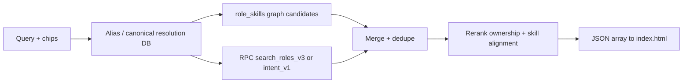
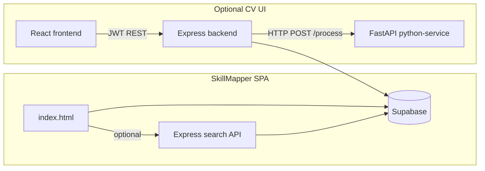
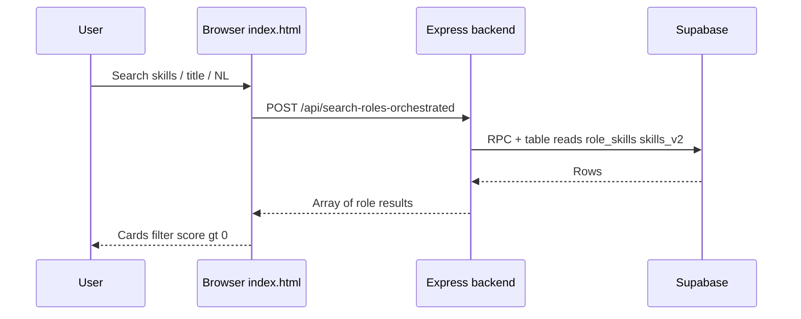
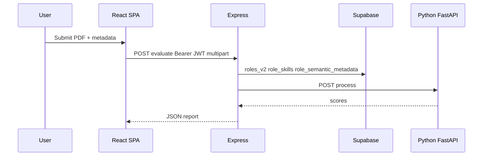

# Skillmapping — System Context (`context.md`)

This document summarizes the repository for onboarding. It reflects the codebase as of the latest inspection (orchestrated role search, Supabase-backed `backend/`, semantic metadata tooling).

---

## Project Overview

This repository contains **two parallel deliverables**:

1. **SkillMapper (production focus)** — A large **single-page application** served from the repo root as **`index.html`**. It maps skills and job titles to roles (with salary hints), supports natural-language search, CV evaluation UX, login/profile flows, salary contributions, feedback, and analytics-style logging. **Primary persistence is PostgreSQL via Supabase**, with RLS for browser clients. **Role search** can call a small **Node + Express API** (`backend/`) that uses the **Supabase service role** to run RPCs and server-side ranking (`POST /api/search-roles-orchestrated`), configured via **`API_BASE_URL`** in `index.html`.

2. **CV Evaluation path (optional React + Python)** — Documented in `README.md`:
   - **`frontend/`** — React + Vite dashboard calling the Express API.
   - **`backend/`** — Node.js + Express: JWT auth against **`sm_users`** in Supabase, CV evaluation that loads **`roles_v2`**, **`role_skills`**, **`skills_v2`**, **`role_semantic_metadata`** from Supabase then **`POST`**s to the Python service.
   - **`python-service/`** — FastAPI service for PDF text extraction and scoring.

Per `README.md`, **Netlify publishes the repo root** (`netlify.toml`) so **`index.html` is the primary production path**; the React app is explicitly marked optional. The **`backend/`** service is deployed separately (e.g. Render) when orchestrated search or protected evaluate flows are used.

---

## Tech Stack

| Layer | Technology | Where used |
|--------|------------|------------|
| **Primary UI** | HTML5, CSS, vanilla JavaScript | Root `index.html` |
| **Primary DB** | **PostgreSQL** (Supabase-hosted) | `roles_v2`, `skills_v2`, `skill_aliases`, `role_skills`, `role_semantic_metadata`, `sm_users`, logs, RPCs (`search_roles_v3`, `search_roles_intent_v1`, …) |
| **Auth (SkillMapper + API)** | Google Identity Services (GIS), email flows, JWT for API; **`sm_users`** in Supabase | `index.html`, `backend/src/routes/auth.js` |
| **Orchestrated search API** | Express, `@supabase/supabase-js` (service role), rate limits | `backend/src/routes/searchRoles.js`, `backend/src/services/search/*` |
| **Analytics** | Google Analytics (gtag) | Root `index.html` |
| **AI / search assist** | Google Gemini REST API, optional Supabase RPC for quota | Root `index.html` |
| **Optional search** | Google Custom Search Engine (config placeholders) | `supabase-config*.js` |
| **Secondary UI** | React 18, Vite 5, Tailwind CSS 3, Recharts, jsPDF | `frontend/` |
| **Secondary API** | Node.js, Express 4, Multer, JWT, bcryptjs, Axios | `backend/` |
| **CV processing** | FastAPI, PyMuPDF, pdfplumber, sentence-transformers (optional), spaCy | `python-service/` |
| **Hosting (documented)** | Netlify (root SPA + optional frontend build), Vercel/Render (backend) | `netlify.toml`, `frontend/netlify.toml`, `backend/vercel.json` |

**Note:** The current **`backend/`** tree uses **Supabase** for users and role data in evaluate flows; it does **not** require MongoDB for those paths. Older README references to Mongoose/Mongo may describe a prior scaffold.

---

## Architecture & Components

### A. SkillMapper — root single-file app

| Component | Responsibility |
|-----------|----------------|
| **`index.html`** | Entire UI, styling, tabs, role matching, NL / title / skills modes, orchestrated search via **`runServerRoleSearch`** → **`API_BASE_URL/api/search-roles-orchestrated`**, login modals, salary modal, onboarding, CV evaluation, Supabase client usage, event tracking. Results with **`final_score` → `score`** mapping; rows with **`score === 0`** are hidden in `render()`. |
| **`supabase-config.js`** | Injected globals for Supabase URL/key (browser; protect with RLS). |
| **`supabase-config.example.js`** | Template without secrets. |
| **`netlify.toml`** | Static publish from `.` and SPA fallback to `/index.html`. |

### B. SkillMapper — orchestrated role search (`backend/src/services/search/`)

Server-side search **does not add a new semantic architecture**: it connects existing tables (`skills_v2`, `skill_aliases`, `role_skills`, `roles_v2`, `role_semantic_metadata`, `role_aliases`) into normalization, retrieval, and reranking.

| Module | Responsibility |
|--------|----------------|
| **`routeSearchRequest.js`** | Chooses workflow: **structured** (skills), **title** (short query), **intent** / **describe** (longer NL). Dedupes across workflows, optional shadow scoring debug, **`search_query_logs`**. |
| **`skillSearchEngine.js`** | Loads aliases → **`resolveProfessionalConcepts`** → enriched query → **`search_roles_v3`** RPC → merges **`fetchSkillGraphRoleRows`** ( **`role_skills`** traversal for resolved skill IDs) → **`rerankStructuredResults`** (required/nice alignment uses **phrase/token overlap**, not only exact string equality, so e.g. “marketing automation” can align to “email marketing”). |
| **`skillGraphRetrieval.js`** | **`fetchSkillGraphRoleRows`**: deterministic candidates from **`role_skills`** for canonical skill IDs; **`mergeRpcAndGraphCandidates`** unions RPC + graph rows before rerank. |
| **`skillAliasResolution.js`** | **`buildSkillAliasIndexes`**, **`resolveProfessionalConcepts`** (n-grams), **`fetchOwnershipFamiliesFromSkillIds`** ( **`role_skills` → `roles_v2.role_family`** ). |
| **`ownershipFamilySignals.js`** | Phrase rules + **`mergePhraseAndDbOwnership`**; boosts/penalties in structured/title/intent rerank. |
| **`titleSearchEngine.js`** | In-memory title/alias scoring over **`roles_v2`** + **`role_aliases`** + **`role_skills`**; same alias resolution and graph boost when skills resolve. |
| **`semanticIntentEngine.js`** | **`search_roles_intent_v1`** with intent input enriched by resolved canonicals; merges skill-graph candidates when skill IDs resolve; intent priors + ownership merge. |

**Supabase SQL (see `supabase/migrations/`):**

- **`search_roles_v3`** — Token + multi-word skill/alias phrase match, title/alias overlap, **`role_skills`** hit ratios in SQL score.
- **`search_roles_intent_v1`** — Intent-style retrieval using **`role_semantic_metadata`** and related signals.

### C. Express API — `backend/src/` (shared)

| Component | Responsibility |
|-----------|----------------|
| **`index.js`** | Express bootstrap: CORS (allowlist + env origins), JSON, **`trust proxy`**, routes, config validation for Supabase env. |
| **`supabaseClient.js`** | **`getSupabaseAdmin()`** — service role or anon key for server-side queries. |
| **`routes/searchRoles.js`** | **`POST /api/search-roles-orchestrated`** — body: `workflow_type`, `input_text`, `skills`, `selected_department`, `currency`, `limit_count`; returns **array of role rows** for `index.html`. |
| **`routes/auth.js`** | Register/login against **`sm_users`** (bcrypt + JWT). |
| **`routes/evaluate.js`** | PDF upload → Supabase role + semantic + **`role_skills`** → Python **`/process`**. |
| **`middleware/auth.js`** | JWT verification. |
| **`middleware/rateLimit.js`** | Rate limits for search, auth, evaluate. |
| **`services/jobs.js`**, **`services/suggestions.js`** | JD stubs / suggestion strings for evaluate pipeline. |
| **`services/semantic/`**, **`services/semanticShadow/`**, **`src/scripts/*.js`** | Role semantic metadata generation, shadow bundle eval/replay — operational tooling, not required for basic search. |
| **`seed.js`** | Legacy noop (“deprecated”). |

### D. CV Evaluation UI — `frontend/` + `python-service/`

| Component | Responsibility |
|-----------|----------------|
| **`frontend/src/App.jsx`** | React UI: auth, CV upload, charts. |
| **`frontend/src/api.js`** | Axios + JWT to **`VITE_API_URL`**. |
| **`python-service/app.py`** | **`/process`** — PDF scoring payload returned to Express. |

---

## Third-Party Integrations

| Integration | Role |
|-------------|------|
| **Supabase** | PostgreSQL, RPCs, **`sm_users`**, role catalog, search functions, RLS for browser. |
| **Google Identity Services** | Sign-in with Google in SkillMapper. |
| **Google Generative Language API (Gemini)** | NL assistance from the browser (key exposure risk — restrict in GCP). |
| **Google Analytics** | gtag in `index.html`. |
| **Google Custom Search** (optional) | Config placeholders. |
| **jsDelivr / Google Fonts** | CDN assets in SkillMapper. |
| **Axios** | HTTP in Express and frontend SPA. |

---

## Data Flow & Processing

### SkillMapper (`index.html` + Supabase + optional Express)

1. User loads site → Supabase client from config.
2. Authenticates → **`sm_users`** (and related) via client and/or API JWT.
3. **Structured search:** user adds skill chips → `refreshStructuredSkillsSearchAndRender` → **`POST .../search-roles-orchestrated`** with `workflow_type: structured`, `skills` array, `input_text` joined from chips.
4. **Title-like short query** (e.g. few tokens): router may classify as **title** workflow.
5. **Natural language:** **intent** workflow → **`search_roles_intent_v1`** path on server.
6. Salary, feedback, CV eval, logs — Supabase tables per existing client code.

All browser-visible keys must rely on **RLS**; orchestrated search uses **service role** only on the server.

### Orchestrated search (high level)

### CV evaluate (`frontend` → `backend` → Python → Supabase reads)

1. JWT auth → **`POST /api/evaluate`** with multipart PDF.
2. Express loads target role and skills from **Supabase**, calls **`PYTHON_SERVICE_URL/process`**.
3. Response returned to client.

---

## Workflow Diagrams

### SkillMapper — orchestrated search (browser → API → Supabase)

### CV — evaluate CV

---

## Assumptions & Notes

- **Dual architecture:** Root SkillMapper can run **mostly client + Supabase**; **orchestrated search** needs **`backend/`** deployed with **`SUPABASE_URL`** and service or anon key, plus CORS origin for the static site.
- **Secrets:** Never commit **`.env`**; use **`backend/.env.example`** as a template.
- **Data quality:** Skills with **no `role_skills` rows** still match via RPC/title overlap, but **graph-first retrieval** is weaker until edges exist (e.g. link **`marketing automation`** to marketing roles in **`role_skills`**).
- **`python-service`:** May download embedding models; similarity fallbacks exist in code paths.
- **Semantic shadow** bundles under **`backend/semantic-bundles/`** are for offline eval / regression tooling.

---

## Purpose of Key Files (repo root relative)

| Path | Purpose |
|------|---------|
| **`README.md`** | Setup for backend, frontend, Python service; deployment notes. |
| **`context.md`** | This onboarding/system summary. |
| **`index.html`** | SkillMapper SPA; **`API_BASE_URL`** for orchestrated search. |
| **`netlify.toml`**, **`supabase-config*.js`** | Netlify publish + browser Supabase config. |
| **`supabase/migrations/*.sql`** | Schema and **`search_roles_v3`**, **`search_roles_intent_v1`**, indexes. |
| **`backend/src/index.js`** | Express app and route mounting. |
| **`backend/src/supabaseClient.js`** | Supabase admin client factory. |
| **`backend/src/routes/searchRoles.js`** | Orchestrated search HTTP API. |
| **`backend/src/routes/auth.js`** | Register/login vs **`sm_users`**. |
| **`backend/src/routes/evaluate.js`** | CV PDF evaluate pipeline. |
| **`backend/src/services/search/*.js`** | Search routing, engines, alias resolution, graph retrieval, ownership signals. |
| **`backend/package.json`** | Dependencies (`@supabase/supabase-js`, express, …). |
| **`backend/.env.example`** | Documents Supabase URL/keys, `FRONTEND_ORIGIN`, `PYTHON_SERVICE_URL`, JWT secret. |
| **`frontend/*`** | Optional React CV evaluator SPA. |
| **`python-service/app.py`** | PDF **`/process`** endpoint. |

---

## Quick onboarding checklist

1. **SkillMapper:** Configure **`supabase-config.js`** from the example; deploy root per **`netlify.toml`**; verify RLS.
2. **Orchestrated search:** Run **`backend/`** with env from **`backend/.env.example`**; set **`API_BASE_URL`** in the SPA to the deployed API URL; allow CORS (**`FRONTEND_ORIGIN`** / **`NETLIFY_ORIGIN`**).
3. **CV path:** Run **`python-service`**, point **`PYTHON_SERVICE_URL`** at it; use **`frontend`** with **`VITE_API_URL`** to the Express API.
